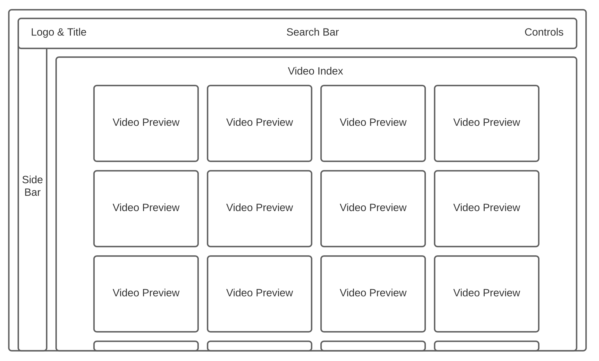
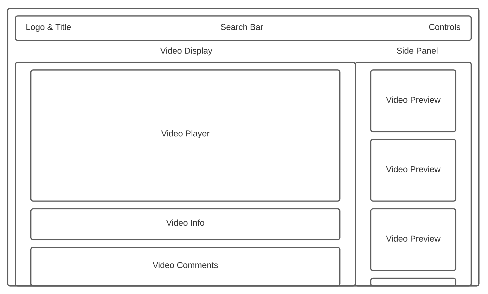

<div align="center">
    
</div>

## Background and Overview 
[ZooTube](https://zootube.herokuapp.com/#/) is a social media website that allows users to upload and share videos with one another. Users can like, dislike, comment on, and search for videos within the site, creating an immersive and social feel that promotes ongoing user engagement. Finally, users can edit and delete their own videos, likes, and comments, achieving a robust CRUD functionality across several key features. Give it a try and see for yourself!

## Architecture and Technologies
* Ruby on Rails
* Postgres
* AWS
* JavaScript
* React/Redux
* HTML
* CSS

## Wireframes




## Liking & Disliking
<div align="center">
    
</div>

Users can 'like' or 'dislike' videos by interacting with the thumbs up and thumbs down buttons beneath each one. Clicking the thumbs up or thumbs down button will call the `handleLike()` or `handleDislike()` function, respectively. When `handleLike()` is invoked, the function will first check to see if there is a `currentUser`. If the user is not currently signed in, they will be redirected to the app's sign in page. Next, assuming there is a `currentUser`, the function will check the status of `this.state.updating`--a boolean value stored in the component's local state--in order to see if the component is already in the process of updating. If so, the function will simply return. 

Assuming there is a `currentUser` and the component is not already `updating`, the function will start the updating process by setting `updating` to 'true' and storing the current `likesCount` and `dislikesCount` for later. From there, some conditional logic is used to determine which type of request should be sent to the backend. Note the variable `currentUserLike` at the start of this conditional logic. If there is a `currentUser` and that user currently likes or dislikes the given video, then `currentUserLike` will contain that single 'like' object as a key-value pair. If not, it will be empty.

So, if an array of `currentUserLike`'s keys has a length of zero (and `currentUserLike` is therefore an empty object, meaning the user currently neither likes nor dislikes the given video), a POST request is sent to the database, creating a new 'like' object unique to that user and video. Otherwise, if `currentUserLike` is not an empty object (meaning the user currently likes or dislikes the given video), the function will check the status of `liked`, a boolean value stored in that object. If `liked` is true (and the user has therefore clicked the thumbs up button on a video they currently like), a DELETE request is sent to the database, destroying the 'like' object associated with that user and video. Meanwhile, if `liked` is false (and the user has therefore clicked the thumbs up button on a video they currently dislike), a PATCH request is sent to the database, updating the 'like' object associated with the current user and video by setting the value of `liked` to 'true'.

In any event, after the correct request is sent to and handled by the database, `likesCount` and `dislikesCount` will be updated accordingly and `updating` will be switched back to 'false'. These first two variables are used to display the number of likes and dislikes next to the thumbs up and thumbs down buttons, and `updating` is used to regulate user input and prevent any potential errors caused by rapid mouse clicks. The `handleDislike()` function works more or less the same.

``` javascript
handleLike() {
    if (!this.props.currentUser) this.props.history.push('/signin');

    if (this.state.updating) return;

    this.setState({ updating: true })
    let currLikes = this.state.likesCount;
    let currDislikes = this.state.dislikesCount;

    if (Object.keys(this.props.currentUserLike).length === 0) {
        this.props.postLike({
            video_id: this.props.video.id,
            liked: true
        })
        .then(() => this.setState({ likesCount: currLikes + 1, updating: false }));
    } else {
        if (this.props.currentUserLike.liked) {
            this.props.deleteLike(this.props.currentUserLike.id)
            .then(() => this.setState({ likesCount: currLikes - 1, updating: false }));
        } else {
            this.props.patchLike({
                id: this.props.currentUserLike.id,
                video_id: this.props.video.id,
                liked: true
            })
            .then(() => this.setState({ likesCount: currLikes + 1, dislikesCount: currDislikes - 1, updating: false }));
        }
    }
}
```

## Search
<div align="center">
    
</div>

A search field within the navbar allows users and guests of the site to quickly search for videos. The integration of search functionality was possible with only minor tweaks to the video controller's index action. When a search is made, whatever text is in the input field is passed into the index action as an argument. From there, Rails will fire an SQL query to select all videos whose lowercased titles include the lowercased query. This helps get around issues with differing capitalization between video titles and search requests. For example, if a user simply searched for 'penguin', or if they accidentally had their caps-lock on, their search results would still include a video with the title 'Penguin Party'. 

```ruby
def index(query = "")
    query = params['query'] || ""
    @videos = Video.where("lower(videos.title) like '%#{query.downcase}%'")
    render :index
end
```

By default, when no query is present, the controller's index action will behave as expected and simply serve up all videos (e.g., when navigating to the video index page).

## Upcoming Features
The following is a list of additional features I would like to add to the site in the future:
* A queue feature that users can add videos to, allowing them to better manage their viewing experience
* Liking, disliking, and replying to comments
* Dynamic search functionality that allows users to search by video length, upload date, view count, and more